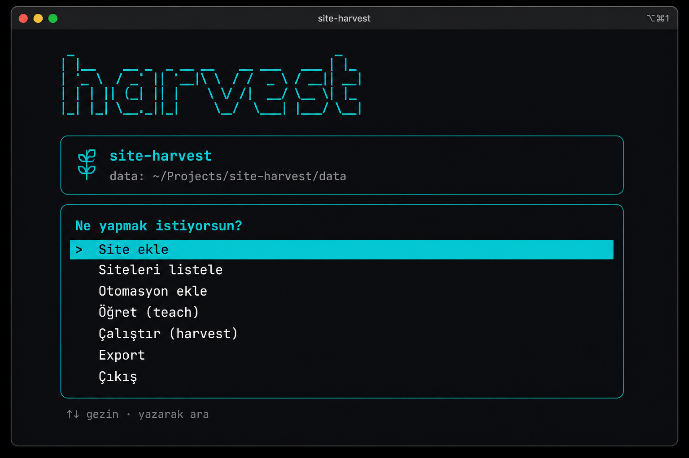

# site-harvest

Local-first terminal app that **teaches** browser flows and **replays** them to harvest repeating page items (text, images, URLs).  
Side project — no cloud, no account. Everything runs through an interactive menu; data stays on disk as JSON (+ media).

**Stack:** .NET 9 · Playwright · Spectre.Console

<p align="center">
  
</p>

## Why

Catalog-style sites (product grids, listing pages, multi-step menus) often need the same scrape shape: navigate → open list → extract fields → optional next page.  
`site-harvest` records that shape once in a headed browser, then runs it headless with an optional item limit.

## Features

- Arrow-key menu for every action (sites, automations, teach, run, export)
- Teach mode: add clicks and fields yourself; clear “repeat for every item?” prompt
- Pagination via a recorded “next” control
- Field types: `text`, `image`, `url`
- Runs under `data/runs/{id}/` with exportable zip
- UTF-8 JSON (non-ASCII characters written literally)

## Requirements

- [.NET 9 SDK](https://dotnet.microsoft.com/download)
- Chromium (install once from the app menu: **Install browser**)

```bash
dotnet restore
dotnet build
dotnet run --project src/SiteHarvest
```

First launch → menu → **Install browser** if Chromium is not installed yet.

## Quick start

```bash
dotnet run --project src/SiteHarvest
```

Then from the menu:

1. **Add site**
2. **Add automation** (site + start URL)
3. **Teach** — mark fields/clicks in the browser
4. **Run harvest** — optional max item count
5. **Export (zip)** when you want a portable package

Optional data directory: `--data /path/to/data` or env `SITE_HARVEST_DATA`.

## Teach

Teach opens a headed browser and a simple arrow-key menu: add clicks, fields, or a next-page control.

<p align="center">
  
</p>

After each **Add click**, you’re asked:

> Repeat this click for every list item? (e.g. open each product detail)

- **Yes** → harvest repeats that click for every sibling card (`listBranch`)
- **No** → one-off navigation (menu, filter, tab…)

You can flip the last click later via the menu.  
Teach stores only `key` + `type` + `selector` (no live values).

## Data layout

Default root: `<repo>/data` (override with `--data` or `SITE_HARVEST_DATA`).  
**Not committed** — see `.gitignore`.

```text
data/
  sites/{id}.json
  automations/{id}.json
  runs/{id}/
    run.json
    items.json
    media/*
  exports/{runId}.zip
```

Example item:

```json
{
  "externalKey": "a1b2c3d4e5f6789012345678",
  "pageUrl": "https://example.com/catalog/item/42",
  "index": 0,
  "types": {
    "title": "text",
    "photo": "image",
    "link": "url"
  },
  "values": {
    "title": "Wireless Headphones Pro",
    "photo": "media/photo_0_ab12cd34.jpg",
    "link": "https://example.com/catalog/item/42"
  }
}
```

## Tests

```bash
dotnet test SiteHarvest.sln
```

CI runs the same on push/PR (GitHub Actions).

## Design notes

- **Menu-only UX** — no subcommands to memorize; open the app and pick an action
- **Local JSON store** — easy to inspect and zip; not a multi-user backend
- **Selectors, not scraped values, in teach** — automations stay reusable
- **Missing fields → null** — one bad card should not kill the run

## Disclaimer

This is a **personal / educational side project**. It runs entirely on your machine and does not host or redistribute scraped content.

You are responsible for how you use it. Before harvesting a site:

- Check the site’s terms of service and robots rules
- Prefer public pages you are allowed to access; do not bypass logins, paywalls, or technical protections
- Keep request volume reasonable; this tool is not for aggressive bulk scraping
- Respect copyright and privacy — do not republish others’ content without a right to do so

The software is provided **as is**, without warranty. The authors are not liable for misuse or for any claims arising from scraped data. See [LICENSE](LICENSE) (MIT).

## License

[MIT](LICENSE) © 2026 Mustafa Senses
